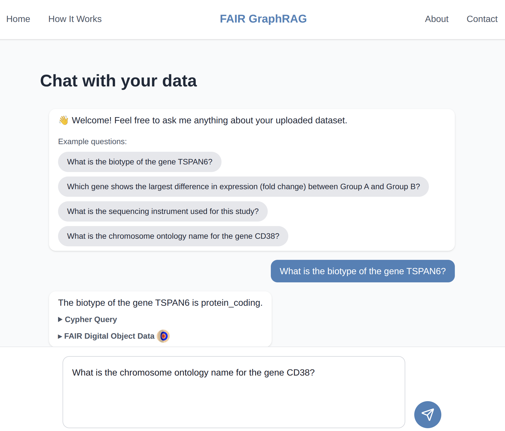

# FAIR GraphRAG Next.js Frontend
This is the user interface for the FAIR GraphRAG system and a [Next.js](https://nextjs.org) project bootstrapped with [`create-next-app`](https://github.com/vercel/next.js/tree/canary/packages/create-next-app). An LLM serves as a chatbot and enables querying a knowledge graph stored in Neo4j for data analysis purposes.



## Getting Started

First, install dependencies:

```bash
npm install
```

Then, run the development server:

```bash
npm run dev
# or
yarn dev
# or
pnpm dev
# or
bun dev
```

## Prerequisites
- A (FAIR) knowledge graph stored in Neo4j graph database
- Azure model access to query OpenAI or open-source LLMs

## Environment

Create a `.env` file by copying and editing the provided `.env_dummy` file and adding your credentials:

```bash
cp .env_dummy .env
```

## Open Project

Open [http://localhost:3000](http://localhost:3000) with your browser to see the result. Open [http://localhost:3000/chat](http://localhost:3000/chat) to see the chat interface.

You can start editing the landing page by modifying `app/page.js`. The page auto-updates as you edit the file.

This project uses [`next/font`](https://nextjs.org/docs/app/building-your-application/optimizing/fonts) to automatically optimize and load [Geist](https://vercel.com/font), a new font family for Vercel.

## Citation

If you use **RAG-interface** in your research or application, please cite the paper:

> M. Flüh, S.-Y. Kim, C. V. Schneider, and S. Geisler, "FAIR GraphRAG: A Retrieval-Augmented Generation Approach for Semantic Data Analysis," in *2025 IEEE International Conference on Knowledge Graph (ICKG)*, Limassol, Cyprus, 2025, pp. 90–97, doi: [10.1109/ICKG66886.2025.00019](https://doi.org/10.1109/ICKG66886.2025.00019).

The accepted version is freely available on arXiv: [arXiv:2607.11464](https://arxiv.org/abs/2607.11464)

<details>
<summary>BibTeX</summary>

```bibtex
@inproceedings{flueh2025fairgraphrag,
  author    = {Fl{\"u}h, Marlena and Kim, Soo-Yon and Schneider, Carolin Victoria and Geisler, Sandra},
  title     = {{FAIR} {GraphRAG}: A Retrieval-Augmented Generation Approach for Semantic Data Analysis},
  booktitle = {2025 IEEE International Conference on Knowledge Graph (ICKG)},
  address   = {Limassol, Cyprus},
  publisher = {IEEE},
  year      = {2025},
  pages     = {90--97},
  doi       = {10.1109/ICKG66886.2025.00019},
  eprint    = {2607.11464},
  archivePrefix = {arXiv},
  primaryClass  = {cs.IR}
}
```

</details>

To cite this software specifically, use the archived release: [](https://doi.org/10.5281/zenodo.21359631)

A machine-readable citation file is included as [`CITATION.cff`](CITATION.cff).
## License

This project is licensed under the [MIT License](LICENSE). You are free to use, modify, and distribute this software with attribution.

## Project Metadata

- **Title:** FAIR Retrieval-Augmented Generation Interface  
- **Description:** A user-interface for interacting with a FAIR-compliant knowledge graph stored in Neo4j graph database.  
- **Keywords:** FAIR Principles, knowledge graph construction, large language model  
- **Authors:**  Marlena Flüh
- **Repository:** https://github.com/FAIR-GraphRAG/RAG-interface
- **License:** MIT
